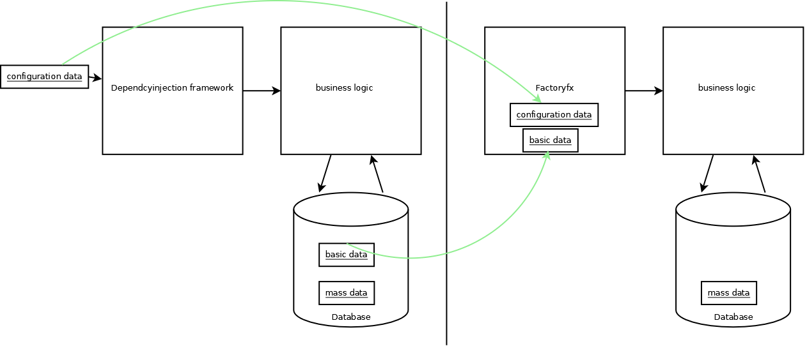

# Factoryfx

*Data and Dependency Injection Framework for java.*

## Introduction

Factoryfx is a lightweight Dependency Injection Framework that extends dependency injection with data injection

## Setup

| Group ID            | Artifact ID | Version |
| :-----------------: | :---------: | :-----: |
| io.github.factoryfx | factory  | 1.0.0  |

##### minimal server
```groovy
compile(group: 'io.github.factoryfx', name: 'factory', version: factoryfxVersion)
```

##### postgres storage with javafx gui
###### server
```groovy
compile(group: 'io.github.factoryfx', name: 'factory', version: factoryfxVersion)
compile(group: 'io.github.factoryfx', name: 'javafxDistributionServer', version: factoryfxVersion)
compile(group: 'io.github.factoryfx', name: 'microserviceRestServer', version: factoryfxVersion)
compile(group: 'io.github.factoryfx', name: 'postgresqlStorage', version: factoryfxVersion)
```
###### client
```groovy
compile(group: 'io.github.factoryfx', name: 'factory', version: factoryfxVersion)
compile(group: 'io.github.factoryfx', name: 'javafxFactoryEditing', version: factoryfxVersion)
compile(group: 'io.github.factoryfx', name: 'microserviceRestClient', version: factoryfxVersion)
```

## Basic example
### Factory
```java
public class HelloWorldFactory extends SimpleFactoryBase<HelloWorld,Visitor> {
    public final StringAttribute text = new StringAttribute().labelText("text");

    @Override
    protected HelloWorld create() {
        return new HelloWorld(text.get());
    }
}
```
### Live object
```java
public class HelloWorld{
    private final String text;

    public Shop(String text) {
        this.text = text;
    }

    public void print(){
        System.out.println(text);
    }
}
```
## Motivation

### Background
Dependency injection requires 2 types of objects.
* business logic
* factory code which instantiate the business logic objects

Most existing dependency injection frameworks try to automate the Factory code.
They scan the classpath and create business object tree.

There are a few drawback with that approach:
* a complete automation is not possible. You need additional information with annotations e.g to exclude classes/exclude from instantiation or polymorphism.
* Annotations are not part of the typesystem and lack tooling
* Classpath scanning and reflection cause confusing stacktraces
* slow startup

### Alternative
Instead of annotations factoryfx use normal java code for the factories. 
The user creates factories following a simple structure convention. The factories provides the dependencies and lifecycle control.

Creating the factories manually offer the following advantages:
#### Advantages:
* no reflection magic means easy to debug and no surprises at runtime
* validation at compile-time
* easy lifecycle control


### Data injection
The major advantage of factoryfx is data injection.

In many java application most data a stored inside a database. With that architecture it is hard to implement data encapsulation which is one of the main feature of oop.
Often you will end up with data only classes and other classes that implements business logic based on the data classes. That will result in a procedural design.
That will cause problems since java is a oop language. 
* performance problems
* requires caching

#### Which kind of data is suitable for injection?
##### Database
Since the framework loads all data into the memory the limit is the available RAM.
Typically a database contains few large tables (e.g more than 100000 rows) and many small tables (e.g less than 10000 rows).
The small tables are good candidates for data injection.
* basic data e.g Products in a simple shop
* mass data e.g. Orders shop 
 

##### Configuration Data
Typical configuration data are ports, hostname, ssl certificates Data which are typical in the database.

## Lifecycle control
Data update steps:
1. read the complete current configuration
2. data changes
3. update new the complete configuration

The framework always works with the complete configuration and no data record.
The advantage is easy cross validation over data records and complete historization.
The major disadvantages are addressed by the framework as well.

* server only execute delta update for the changes live objects
* expensive resources like sockets or database pools can be reused


## User interface


## Documentation

* [datainjection](docu/src/main/java/de/factoryfx/docu/datainjection/usecase.md)
* [dependencyinjection](docu/src/main/java/de/factoryfx/docu/dependencyinjection/usecase.md)
* [dynamicwebserver](docu/src/main/java/de/factoryfx/docu/dynamicwebserver/usecase.md)
* [lifecycle](docu/src/main/java/de/factoryfx/docu/lifecycle/usecase.md)
* [migration](docu/src/main/java/de/factoryfx/docu/migration/usecase.md)
* [parametrized](docu/src/main/java/de/factoryfx/docu/parametrized/usecase.md)
* [persistentstorage](docu/src/main/java/de/factoryfx/docu/persistentstorage/usecase.md)
* [polymorphism](docu/src/main/java/de/factoryfx/docu/polymorphism/usecase.md)
* [reuse](docu/src/main/java/de/factoryfx/docu/reuse/usecase.md)
* [monitoring](docu/src/main/java/de/factoryfx/docu/monitoring/usecase.md)


## Example

[**code**](https://github.com/factoryfx/factoryfx/tree/master/example/src/main/java/de/factoryfx/example)

## License

Released under the [Apache 2.0 license](http://www.apache.org/licenses/LICENSE-2.0.html).

