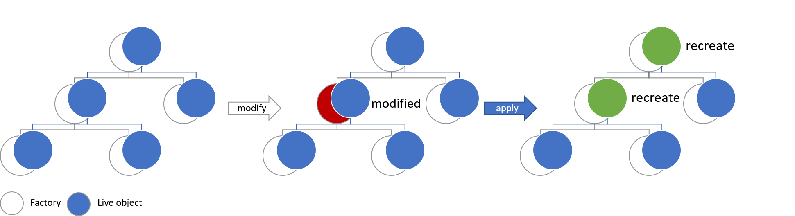

# Immutability

##What is Immutability

### Mutable
```java
public class Printer{
    private String text;
    
    public void setText(String text){
        this.text=text;
    }

    public void print(){
        System.out.println(text);
    }
    
}
```

### Immutable
```java
public class Printer{
    private final String text;
    
    public Printer(String text){
        this.text=text;
    }

    public void print(){
        System.out.println(text);
    }
    
}
```


##why use immutability

* reproducibility
* performance (parallel computing, no io )
* Shared state (popular oop critic) https://www.youtube.com/watch?v=QM1iUe6IofM&t=1205s

##The problem

real world application need mutable data. How make a immutable application mutable?  
=> Recreate all  

=> optimize recreation

=> Factoryfx implentation

