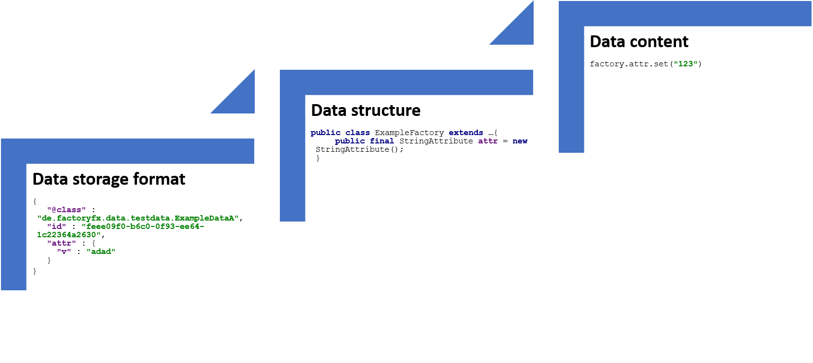

# Migration
Data migration plays an important role in FactoryFX because FactoryFX unites data and application structure into one factory structure. Migrations are required not only for data changes but also for application structure changes. 
To simplify the migration process FactoryFX provides a dedicated migration API.

In FactoryFX we distinguish between 3 layers of migrations
* **Data storage format**<br> The general format how data and attributes are stored.
* **Data structure**<br> Structure of the Factories e.g.: attributes name, factory names
* **Data content**<br> Data content changes


## Data storage format migration
```json
{
  "@class" : "io.github.factoryfx.data.merge.testdata.ExampleDataA",
  "id" : "feee09f0-b6c0-0f93-ee64-1c22364a2630",
  "stringAttribute" : {
    "v" : "adad"
  }
}
```
This is an example for the json format of a factory with a StringAttribute.
The StringAttribute is serialized to a nested object and the value is stored in the "v" attribute. 
This rather unusual structure can be put down to limitations of Jackson.
The structure format is mostly stable but may change if, for example Jackson adds a new useful feature in the future.

Data storage format migrations are handled by the framework when the data is loaded; a format change requiring project code should hardly be necessary in practice.

## Data structure migration
The most common cases are refactorings in the factory structure. (comparable to refactoring operations in the IDE)
```java
public class ExampleFactory extends SimpleFactoryBase<Void,Void,ExampleFactory> {
    public final StringAttribute oldAttribute= new StringAttribute();
}
public class ExampleFactory extends SimpleFactoryBase<Void,Void,ExampleFactory> {
    public final StringAttribute newAttribute= new StringAttribute();
}
```
In this example the attribute is renamed from "oldAttribute" to "newAttribute".

```java
builder.withRenameAttributeMigration(ExampleFactory.class,"oldAttribute",(rf)->rf.newAttribute)
```
This adds a rename migration. To support multiple renames the new name is provided as a lambada expression and thereby enables IDE refactoring for the migrations. This also prevents rename cycles.
Migrations are added with the MicroserviceBuilder.

The other declarative structure migrations follow the same style:
```java
//factory class renamed or moved to another package
builder.withRenameClassMigration("com.example.OldExampleFactory", ExampleFactory.class)
//custom attribute class renamed or moved (serialized form unchanged), e.g. a shared attribute moved to a library
builder.withRenameAttributeClassMigration("com.example.OldCustomAttribute", CustomAttribute.class)
//attribute type changed: convert the previously stored value instead of dropping it
builder.withRetypeAttributeMigration(ExampleFactory.class, String.class, (f)->f.stringListAttribute, (old)->List.of(old.split(",")))
```
Without a registered retype migration, lossless conversions between the built-in scalar attribute types (single&harr;list, number/boolean&harr;string) are applied automatically; anything else clears the value with a warning in the log.

## Data content
Data content changes are covered by configuration patches registered on the MicroserviceBuilder. Patches are applied in-memory whenever a configuration (current or history) is loaded, the stored data is not modified.
```java
//applied on every load (must be idempotent)
builder.withPatch((root, metadata, objectMapper) -> {...})
//version-gated, run-once semantics based on the configuration schema version stored in the metadata
builder.withPatch(0, 1, (root, metadata, objectMapper) -> {...})
```
Version-gated patches chain in version order and self-skip once a configuration has been saved with the current schema version. Use `Microservice#persistConfigurationPatches` to explicitly write patched configurations including the bumped schema version back to the storage.
For one-off data changes you can still use the normal microservice update API or the DataStorage API.

**Run-once vs every-time.** Pick the variant by what should happen after a user edits the patched data:
* **Version-gated (run-once)** for one-time data evolution — new defaults, newly wired factories, moved values. The patch runs once per stored configuration; afterwards user edits stick. Example: a patch that creates and wires a `SendEmailFactory` — if an admin later removes that email configuration deliberately, the removal must not be reverted on the next load. Idempotency alone can't provide this: an idempotent every-time patch would re-impose its result on every load.
* **Every-time** for enforcing environment/technical invariants that must hold regardless of user edits — e.g. overwriting database connection settings per environment. This is enforcement, not migration: it is supposed to re-apply forever, and it must be idempotent.

Unlike the declarative structure migrations (which self-skip because the stored metadata dictionary reveals whether the structure is already current), data patches leave nothing in the data that distinguishes "not yet applied" from "applied and later changed by a user" — the configuration schema version is exactly that marker, stored atomically with each configuration.

## Verifying an upgrade
`Microservice#preflightCheck` verifies without starting the application that the current software version can load the stored configuration (patches, migrations, json binding, validation, treeBuilder rebuild). `Microservice#saveConfigurationSnapshot` saves the configuration in its raw stored form as a rollback safety net before an upgrade; `Microservice#loadConfigurationSnapshot` restores it through the regular load path.


## Special case: Persisting patches
Normally migrations and patches are executed on the fly when the data is loaded.
This has the advantage that a faulty migration can't destroy old data. Mistakes in the migration code are easier to fix because you don't have to repair data.

In some cases it can be convenient to write the patched configurations back to the storage, e.g. before removing a patch from the code or to make an urgent data fix durable immediately.

```java
Microservice<Server, ServerFactory> microservice = builder.microservice()
        .withPatch(0, 1, (root, metadata, objectMapper) -> {...})
        .build();
microservice.persistConfigurationPatches();//applies the registered patches to all stored configurations (current and history) and writes them back, including the bumped configuration schema version
```

## Example
[**code**](https://github.com/factoryfx/factoryfx/tree/master/docu/src/main/java/io/github/factoryfx/docu/migration)